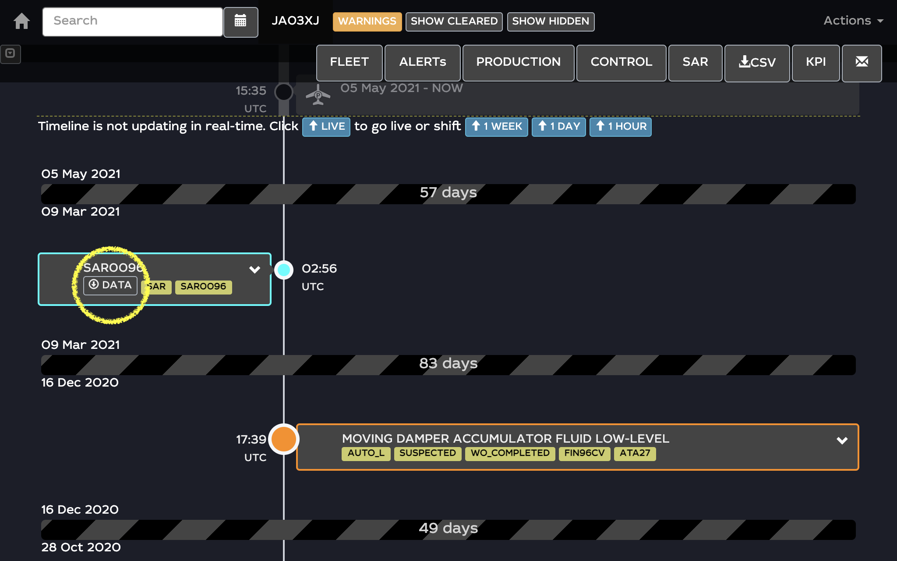

SAR Import and Integration User Guide
====

SAR files can be uploaded and integrated to wilco. 

This is the process to import and integrates SAR Files : 
- You can select the SAR file, then the file is uploaded and checked  
- Wilco Display Statistics about the file 
- You can confirm insertion of the SAR Data in the A/C timeline
- You can see the integration with a SAR tag in the timeline
- You can delete the file
- You can visualize detailed graph in the wilco dashboard
 

Import and check the SAR Files
====

| User Action & Description  | ScreenShot |
| :------------------- |:---------------|
| **Import and check the SAR Files** : It's possible to access the SAR import and integration process in the homepage SAR button, on the top of the screen. |      |
| **To import SAR file select the "LOAD BAR" button :** |              |
| **Select the CSV file to import :** |           |
| **Wait for the upload & checkings :** During the upload and the checking process, the "CHECK SAR" button blinks, and become green when it's OK |  |
| **Statistics of the upload** When the file is uploaded, wilco display main informations about the file : (The SAR Identification and the Trgiger Number, The number of lines and the numbers of fields, The timestamp of the first recorded data from the A/C, The timestamp of the last recorded data from the A/C) |  |
| If the file has been already integrated in the wilco data base, you are alerted that it's not possible to upload it again, a "NOK" button is displayed , see below to see how to delete a previous integration to re-upload it  |  |

Insert the SAR File in the A/C Timeline
====

| User Action & Description  | ScreenShot |
| :------------------- |:---------------|
| **Insert the Uploaded Data to the A/C Timeline :** To insert the data in the A/C Timeline, you need to press INSERT : |  |
| **Jauge Progression :** Wilco indicates the insertion progression with a violet chart |  |
| **SAR Tag in the Aircraft Timeline :** You can retreive the SAR Inport in the aircraft timeline |  |
| When you click on the "ACTM" button, the access to the aircraft timeline, the SAR tag is in blue color in the left side. |  |    

Download or Delete SAR File from the timeline
====

| User Action & Description  | ScreenShot |
| :------------------- |:---------------|
| It's possible to download the SAR File from the timeline by clicking on the "DATA" Button |  |
| Also you can delete the SAR file insertion from the timeline and from the wilco database by clicking "DELETE" Button. In this case you can re-import it again |  |

Access to the Dashboard Analysis
====

| User Action & Description  | ScreenShot |
| :------------------- |:---------------|
| It's possible to access detailed dashboard chart by clicking on the "DASHD" Button |  |
| Then you access to data analysis |  |
